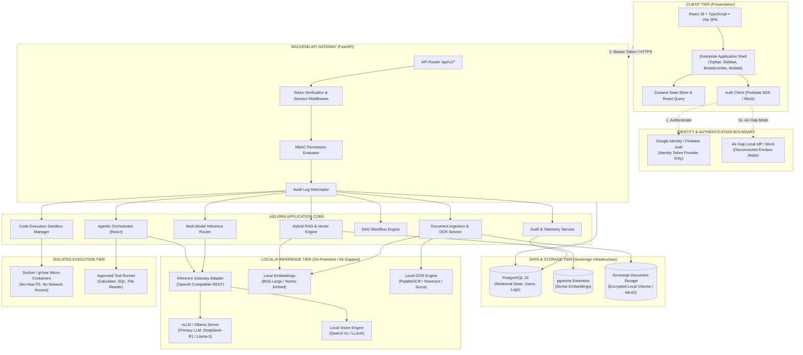
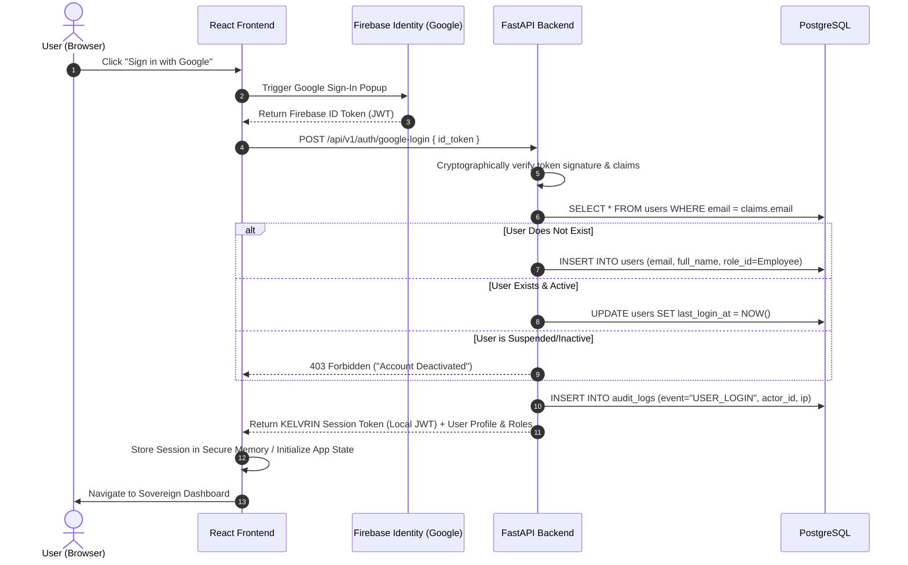
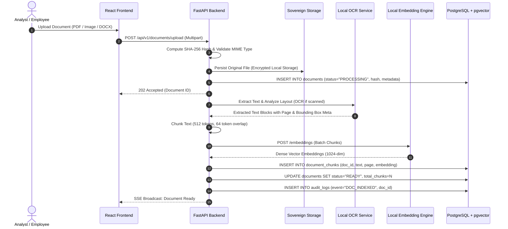
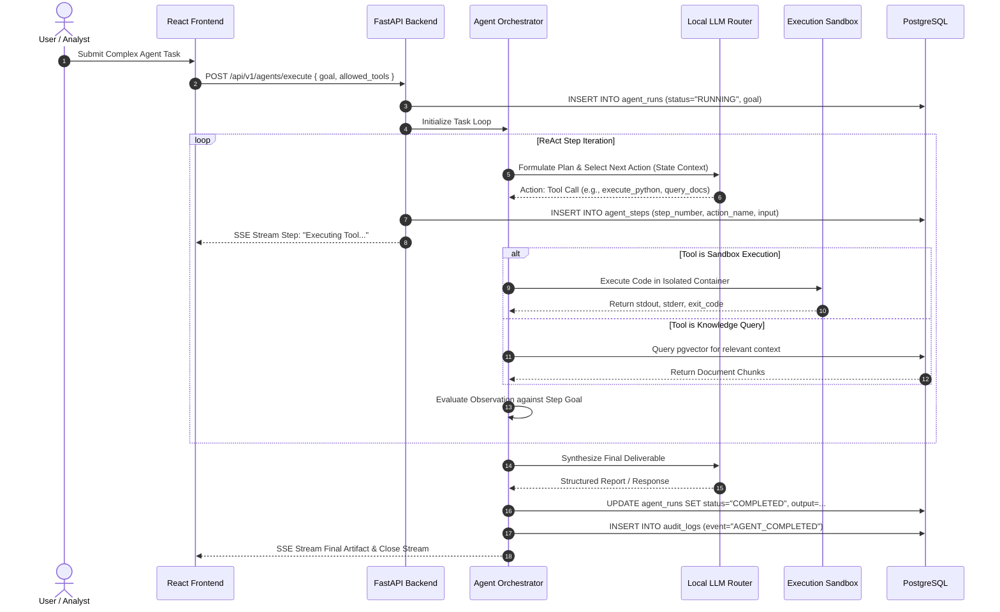
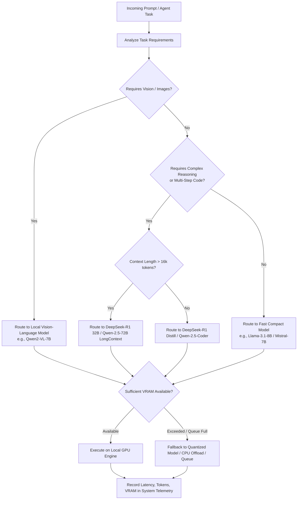

# KELVRIN: Architecture Specification
## Sovereign Agentic AI Workbench

---

## 1. Executive Summary & Sovereign Mission

**KELVRIN** is an enterprise-grade, sovereign agentic AI workbench engineered for organizations operating under strict data governance, regulatory oversight, and privacy mandates (e.g., defense, intelligence, healthcare, financial services, and critical infrastructure).

### Core Problem Statement
Modern enterprise AI adoption is severely constrained by third-party cloud API dependencies:
1. **Confidential Data Exposure**: Sending proprietary documents, source code, strategy briefs, or health records to commercial LLM APIs risks breach of compliance and sovereign intellectual property leaks.
2. **Fragile Agent Autonomy**: Autonomous agents requiring unmonitored code execution and tool interactions pose catastrophic risks if allowed unmetered host access or open internet egress.
3. **Lack of Verifiable Auditing**: Black-box cloud inference prevents cryptographic audit trails required by statutory compliance frameworks (SOC2 Type II, ISO 27001, HIPAA, GDPR, FedRAMP).

### Sovereign Value Proposition
KELVRIN resolves these challenges through a **Zero-Leakage, Sovereign Architecture**:
- **100% Local Inference**: Zero transmission of document payloads, prompts, embeddings, or agent reasoning traces to external commercial AI endpoints.
- **Identity Decoupled from Data**: Firebase Authentication is utilized solely as an identity verifier for Google Sign-In, strictly isolated from application storage, databases, and inference pipelines.
- **Auditable Agent Execution**: All agentic planning, tool invocation, observation, and code execution occur inside isolated, sandboxed environments with tamper-evident audit logging.
- **Hybrid-to-Air-Gap Portability**: Operates seamlessly in enterprise hybrid environments with Google Identity, or in true air-gapped disconnected enclaves with local identity providers.

---

## 2. The 20 Architectural Principles

| # | Principle | Architectural Realization |
|---|---|---|
| 1 | **React + TypeScript + Vite Frontend** | Modern, strictly-typed single-page application with reactive state management and high-performance compilation. |
| 2 | **Python + FastAPI Backend** | High-concurrency async ASGI backend with Pydantic validation, structured exception handling, and native AI library compatibility. |
| 3 | **PostgreSQL Primary Database** | Acid-compliant relational engine managing relational state, user metadata, audit records, and vector embeddings (via `pgvector`). |
| 4 | **Firebase Auth Exclusively for Identity** | Firebase Auth is utilized exclusively for Google Sign-In token generation. Zero application data ever touches Firebase services. |
| 5 | **Strict Firebase Isolation** | Zero usage of Cloud Firestore, Firebase Storage, Firebase Functions, or Firebase Realtime Database. |
| 6 | **On-Premises Data Sovereignty** | All documents, vector embeddings, chat logs, prompts, and agent artifacts are stored on sovereign storage volumes under organization control. |
| 7 | **Local Open-Weight Model Inference** | Inference engines (vLLM, Ollama, llama.cpp, Triton) run strictly on local GPUs or on-premises server clusters. |
| 8 | **Dynamic Multi-Model Routing** | Intelligent model dispatch layer routing prompts based on task complexity, context length, modality, and VRAM utilization. |
| 9 | **Multimodal Processing Pipeline** | Native parsing of text, scanned PDFs, tables, forms, and images using local OCR (Tesseract / PaddleOCR / Surya) and local Vision-Language Models (Qwen2-VL, LLaVA). |
| 10 | **Formal Agentic Workflow Loop** | Strict ReAct / Plan-and-Execute lifecycle: Goal &rarr; Plan &rarr; Action &rarr; Observation &rarr; Validation &rarr; Deliverable. |
| 11 | **Sandboxed Code Execution** | Isolated compute environments (gVisor/Docker containers, restricted cgroups, seccomp filters) with zero host access and disabled egress. |
| 12 | **Backend-Enforced RBAC** | Granular permission gates evaluated at API dependency layers; UI hiding is cosmetic, backend validation is authoritative. |
| 13 | **Comprehensive Audit Logging** | Append-only, structured audit logs recording every login, document access, model prompt, tool execution, and role change. |
| 14 | **Docker-Ready Containerization** | Modular multi-stage Dockerfiles and Docker Compose orchestrating all services with deterministic networking. |
| 15 | **Dual Deployment Compatibility** | Runs identically on local developer machines, bare-metal enterprise servers, or private VPC cloud deployments. |
| 16 | **Zero Hardcoded Secrets** | Strict 12-factor configuration using environment variables, secrets management, and encrypted runtime keyrings. |
| 17 | **Strict Git Hygiene** | `.env`, credentials, local model weights, and sensitive data directories are strictly excluded from source control. |
| 18 | **Zero External Data Leakage** | Enforced network egress policies prevent any outbound HTTP requests containing confidential payload data. |
| 19 | **Explicit Tool/Connector Registry** | Third-party or external connectors are disabled by default and require explicit administrative activation and approval. |
| 20 | **Honest Sovereignty Claims** | Clear distinction between *Hybrid Sovereign Mode* (external Google Auth enabled) and *True Air-Gapped Mode* (local identity provider only). |

---

## 3. High-Level System Architecture



---

## 4. Component Responsibilities

### 4.1 Frontend Responsibilities (`frontend/`)
- **Single-Page Application**: React 18 with TypeScript and Vite for near-instant HMR and production bundle optimization.
- **Enterprise Design Language**: Polished SaaS interface adhering to the dark navy navigation, light workspace, subtle green security badges, and purple/blue AI accents.
- **Role-Aware UI Rendering**: Dynamic navigation and control visibility driven by backend user permission contexts (with explicit understanding that backend remains authoritative).
- **Real-Time Streaming**: Server-Sent Events (SSE) and WebSocket consumers for streaming token generation, agent execution traces, and telemetry feeds.
- **Secure Token Handling**: Managing short-lived session tokens in memory, handling silent refresh, and initiating clean sign-out without residual state.

### 4.2 Backend Responsibilities (`backend/`)
- **API Gateway & Routing**: FastAPI async framework exposing structured REST endpoints under `/api/v1/`.
- **Identity Verification & Session Generation**: Validating Firebase Google ID tokens using Google's public cryptographic certs, matching against the local PostgreSQL `users` registry, and issuing internal sovereign sessions.
- **Authoritative RBAC**: Enforcing strict role and permission checks on every incoming request using FastAPI dependencies (`Depends(require_permission(...))`).
- **Orchestration Layer**: Managing asynchronous background jobs for document OCR, embedding generation, workflow DAG execution, and agent task loops.
- **Auditing Interceptor**: Recording immutable event logs for every significant state mutation, document download, code execution, or model query.

### 4.3 Database Responsibilities (`PostgreSQL + pgvector`)
- **Relational Integrity**: Complete schema definition with primary keys, foreign keys, unique constraints, and check constraints across 18 core tables.
- **Vector Search Engine**: Utilizing `pgvector` for storing dense document chunk embeddings with HNSW or IVFFlat indexing for sub-100ms semantic similarity queries.
- **Hybrid Retrieval**: Combining full-text search (`tsvector` with BM25-style ranking) and vector distance calculation for high-precision retrieval.
- **Audit Persistence**: Append-only audit table with sequential transaction tracking, actor logging, and tamper-resistant indexing.

### 4.4 Local AI Responsibilities (`vLLM / Ollama / Local Engines`)
- **Zero Cloud Leakage**: Performing 100% of LLM inference, embedding generation, and vision processing on local compute resources.
- **Model Diversity**: Managing a pool of local models:
  - *Reasoning / Complex Tasks*: DeepSeek-R1, Qwen-2.5-72B (quantized).
  - *High-Throughput / Routing*: Llama-3.1-8B-Instruct, Mistral-7B.
  - *Vision / Multimodal*: Qwen2-VL-7B-Instruct, LLaVA-v1.6.
  - *Embeddings*: BAAI/bge-m3, nomic-embed-text-v1.5.
- **OpenAI-Compatible Abstraction**: Exposing local models through a unified HTTP/REST abstraction so backend engines interface via standardized payloads.

### 4.5 Agent Responsibilities (`ReAct & Plan-and-Execute`)
- **Iterative Reasoning Loop**: Autonomous execution following strict operational phases:
  1. *Task Decomposition*: Breaking user goals into sequential steps.
  2. *Tool Selection*: Choosing tools exclusively from the administrative-approved registry.
  3. *Action Dispatch*: Formulating typed tool inputs.
  4. *Observation*: Capturing tool output or sandbox return code.
  5. *Self-Correction & Validation*: Verifying output validity against the step objective.
  6. *Deliverable Synthesis*: Producing the final user-facing response or artifact.
- **Human-in-the-Loop (HITL)**: Mandatory suspension of execution when encountering high-risk actions (e.g., executing code, modifying database state, or accessing restricted documents), requiring Approver role sign-off.

### 4.6 RAG Responsibilities
- **Multimodal Document Ingestion**: Ingesting PDF, DOCX, XLSX, TXT, and scanned image formats.
- **Local OCR Pre-Processing**: Routing image-only or mixed PDF pages through local OCR before text extraction.
- **Hierarchical Chunking**: Applying token-aware sliding window chunking preserving document headers, page numbers, and structural context.
- **Dense & Sparse Indexing**: Generating normalized dense embeddings and inverted text indexes.
- **Provenance & Citation Grounding**: Every generated statement in document chat must cite specific chunk IDs, document hashes, and page numbers.

---

## 5. End-to-End System Lifecycles

### 5.1 Authentication & Session Lifecycle


### 5.2 Document Ingestion & RAG Lifecycle


### 5.3 Agent Execution Lifecycle


### 5.4 Model Routing Lifecycle


---

## 6. Deployment Topologies

### 6.1 Hybrid Sovereign Deployment (Development / Standard Enterprise)
- **Identity Provider**: Google Sign-In via Firebase Auth.
- **Application & Data**: Hosted 100% within the organization's private VPC or on-premises servers.
- **Data Boundary Guarantee**: No document content, prompt context, or agent data leaves the local boundary. Only the user's initial email verification handshake touches Google.

### 6.2 True Air-Gapped Deployment (Defense / Maximum Security Enclave)
- **Identity Provider**: Local OpenID Connect (Keycloak), LDAP/Active Directory, or Sovereign Mock Auth.
- **Network Boundary**: Zero physical or logical external internet connectivity.
- **Model Storage**: Pre-cached open-weight model weights mounted via offline encrypted NVMe storage.
- **Containers**: Base images pulled from an internal private registry.
- **Audit Guarantees**: Immutable local file logs combined with syslog export to internal SIEM (Splunk, Elastic).

---

## 7. Sovereign Security Hardening & Enterprise Architecture

### 7.1 Multi-Tenant Row-Level Security (RLS)
The database enforces strict inter-tenant separation using PostgreSQL Row-Level Security (RLS) on all multi-tenant entity tables (`users`, `documents`, `deliverables`, `conversations`, `agent_runs`):
1. **Database Session Variable**: The ASGI tenant middleware extracts the authenticated user's `company_code` and executes `SET LOCAL app.current_company_code = :company_code`.
2. **PostgreSQL RLS Policies**:
   ```sql
   ALTER TABLE documents ENABLE ROW LEVEL SECURITY;
   CREATE POLICY tenant_isolation_policy ON documents
   USING (company_code IS NULL OR company_code = current_setting('app.current_company_code', true));
   ```
3. **Application Authorization Guard**: Centralized in `backend/app/core/tenant.py` (`authorize_tenant_access`). Unauthorized cross-tenant queries strictly return `404 Not Found`, eliminating information leakage and resource enumeration.

### 7.2 Cryptographic Token Revocation & Server-Side Blacklisting
To prevent replay attacks and ensure real session termination:
- **Revocation Table**: The `revoked_tokens` table tracks SHA-256 token hashes, `jti` identifiers, revocation reasons, and expiry timestamps.
- **Request-Level Enforcement**: The `get_current_user` FastAPI dependency verifies that the inbound token is not present in `revoked_tokens`.
- **Token Rotation**: `/api/v1/auth/refresh` immediately blacklists the old token before issuing a newly rotated token.
- **Immediate Logout**: `/api/v1/auth/logout` revokes the caller's active session instantly.

### 7.3 Schema Management via Alembic Migrations
In strict compliance with defense and enterprise standards, runtime schema generation via `Base.metadata.create_all()` is prohibited:
- **Single Source of Truth**: All schema definitions, indexes, constraints, and RLS policies are tracked under `backend/alembic/versions/`.
- **Deployment Procedure**: Migrations are applied deterministically via `alembic upgrade head`.
- **Test Isolation**: The test suite provisions isolated test databases using Alembic programmatic execution (`alembic.command.upgrade`), guaranteeing schema parity between testing and production environments.

### 7.4 Connector Boundary Defenses & SSRF Prevention
External connector endpoints in `RestConnectorService` are secured against Server-Side Request Forgery (SSRF):
- **Protocol Whitelist**: Only `http` and `https` schemes are accepted.
- **Network Blacklist**: Blocks loopback (`127.0.0.0/8`, `::1`), private RFC 1918 subnets (`10.0.0.0/8`, `172.16.0.0/12`, `192.168.0.0/16`), link-local/cloud metadata (`169.254.0.0/16`, `metadata.google.internal`), carrier-grade NAT, multicast, and DNS rebinding to internal addresses.

### 7.5 Architectural Reality: Real Resources vs. On-Premises & Simulation Fallbacks
- **Real Subsystems**: Relational database persistence, Alembic migrations, PostgreSQL RLS, JWT session revocation, PBKDF2 hashing, POSIX sandbox limits (`rlimit_cpu`, `rlimit_as`, AST import restriction), deliverable synthesis (`.docx`, `.xlsx`, `.pptx`, `.pdf`), immutable audit logging with secret masking.
- **Local AI Inference**: Connects to local OpenAI-compatible endpoints (Ollama / vLLM / Triton) on the internal enclave network. When offline, structured HTTP 503 errors or deterministic simulation responses are returned without crashing or making external network dials.
