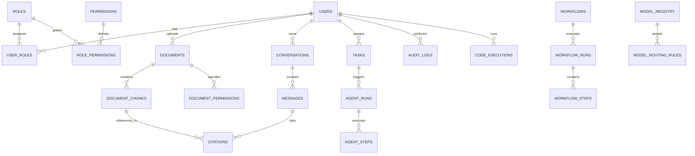

# KELVRIN: Relational Database Architecture & PostgreSQL Schema

---

## 1. Database Principles & Engine Standards

1. **Primary Database Engine**: PostgreSQL 16+ with the `pgvector` extension enabled for native vector similarity search.
2. **ACID Guarantees**: Complete transactional isolation with foreign key constraints, cascading policies, and unique integrity checks.
3. **Primary Key Convention**: Universally unique identifiers (`UUIDv4` or `UUIDv7`) for all primary keys to prevent enumeration attacks and facilitate multi-node replication.
4. **Data Isolation**: Strict separation between system configuration, identity mappings, sovereign document storage metadata, and immutable audit logs.
5. **No Cloud Data Stored Externally**: Zero reliance on external managed cloud databases (no Firebase Firestore, no Supabase Cloud, no DynamoDB). All data resides on PostgreSQL storage volumes managed on-premises or within the organization's sovereign VPC.

---

## 2. Entity-Relationship Model



---

## 3. Detailed Table Schemas

### 3.1 Identity & Access Control (RBAC)

#### `roles`
| Column | Type | Constraints | Description |
|---|---|---|---|
| `id` | `UUID` | `PRIMARY KEY DEFAULT gen_random_uuid()` | Role unique identifier |
| `name` | `VARCHAR(50)` | `NOT NULL UNIQUE` | Role name (e.g., `Super Admin`, `Analyst`) |
| `description` | `TEXT` | `NULL` | Role purpose and scope |
| `is_system_role`| `BOOLEAN` | `NOT NULL DEFAULT true` | Prevents deletion of core roles |
| `created_at` | `TIMESTAMPTZ` | `NOT NULL DEFAULT clock_timestamp()` | Creation timestamp |

#### `permissions`
| Column | Type | Constraints | Description |
|---|---|---|---|
| `id` | `UUID` | `PRIMARY KEY DEFAULT gen_random_uuid()` | Permission unique identifier |
| `code` | `VARCHAR(100)`| `NOT NULL UNIQUE` | Permission slug (e.g., `documents:upload`) |
| `module` | `VARCHAR(50)` | `NOT NULL` | Module group (e.g., `documents`, `models`) |
| `description` | `TEXT` | `NULL` | Scope explanation |

#### `role_permissions`
| Column | Type | Constraints | Description |
|---|---|---|---|
| `role_id` | `UUID` | `REFERENCES roles(id) ON DELETE CASCADE` | Foreign key to role |
| `permission_id`| `UUID`| `REFERENCES permissions(id) ON DELETE CASCADE` | Foreign key to permission |
| `PRIMARY KEY` | `(role_id, permission_id)` | Compound primary key |

#### `users`
| Column | Type | Constraints | Description |
|---|---|---|---|
| `id` | `UUID` | `PRIMARY KEY DEFAULT gen_random_uuid()` | Internal sovereign user identifier |
| `email` | `VARCHAR(255)`| `NOT NULL UNIQUE` | User email address |
| `full_name` | `VARCHAR(255)`| `NOT NULL` | Display name |
| `avatar_url` | `TEXT` | `NULL` | Profile picture URI |
| `auth_provider`| `VARCHAR(50)` | `NOT NULL DEFAULT 'google_firebase'`| Identity provider (`google_firebase`, `local`) |
| `external_id` | `VARCHAR(255)`| `NULL UNIQUE` | Google/Firebase UID for mapping |
| `password_hash`| `VARCHAR(255)`| `NULL` | Salted hash for air-gapped local authentication |
| `status` | `VARCHAR(20)` | `NOT NULL DEFAULT 'ACTIVE'` | `ACTIVE`, `SUSPENDED`, `DEACTIVATED` |
| `last_login_at`| `TIMESTAMPTZ` | `NULL` | Last successful authentication |
| `created_at` | `TIMESTAMPTZ` | `NOT NULL DEFAULT clock_timestamp()` | Registration timestamp |
| `updated_at` | `TIMESTAMPTZ` | `NOT NULL DEFAULT clock_timestamp()` | Record update timestamp |

#### `user_roles`
| Column | Type | Constraints | Description |
|---|---|---|---|
| `user_id` | `UUID` | `REFERENCES users(id) ON DELETE CASCADE` | Foreign key to user |
| `role_id` | `UUID` | `REFERENCES roles(id) ON DELETE RESTRICT` | Assigned role |
| `assigned_by` | `UUID` | `REFERENCES users(id) ON DELETE SET NULL` | Super Admin who granted role |
| `assigned_at` | `TIMESTAMPTZ` | `NOT NULL DEFAULT clock_timestamp()` | Assignment timestamp |
| `PRIMARY KEY` | `(user_id, role_id)` | Compound primary key |

---

### 3.2 Document Storage & Retrieval (RAG)

#### `documents`
| Column | Type | Constraints | Description |
|---|---|---|---|
| `id` | `UUID` | `PRIMARY KEY DEFAULT gen_random_uuid()` | Document unique identifier |
| `title` | `VARCHAR(255)`| `NOT NULL` | Display title |
| `filename` | `VARCHAR(255)`| `NOT NULL` | Original uploaded file name |
| `file_path` | `TEXT` | `NOT NULL` | Local encrypted storage path |
| `file_size_bytes`| `BIGINT`| `NOT NULL` | Byte size |
| `mime_type` | `VARCHAR(100)`| `NOT NULL` | MIME type (e.g., `application/pdf`) |
| `sha256_hash` | `CHAR(64)` | `NOT NULL UNIQUE` | Cryptographic hash for deduplication |
| `classification`| `VARCHAR(50)`| `NOT NULL DEFAULT 'INTERNAL'` | `INTERNAL`, `CONFIDENTIAL`, `RESTRICTED` |
| `status` | `VARCHAR(20)` | `NOT NULL DEFAULT 'PENDING'` | `PENDING`, `PROCESSING`, `READY`, `FAILED` |
| `ocr_applied` | `BOOLEAN` | `NOT NULL DEFAULT false` | Whether OCR extraction was required |
| `total_pages` | `INTEGER` | `NOT NULL DEFAULT 1` | Document page count |
| `total_chunks`| `INTEGER` | `NOT NULL DEFAULT 0` | Extracted chunk count |
| `uploaded_by` | `UUID` | `REFERENCES users(id) ON DELETE SET NULL` | Uploading user |
| `created_at` | `TIMESTAMPTZ` | `NOT NULL DEFAULT clock_timestamp()` | Upload timestamp |
| `updated_at` | `TIMESTAMPTZ` | `NOT NULL DEFAULT clock_timestamp()` | Update timestamp |

#### `document_chunks`
| Column | Type | Constraints | Description |
|---|---|---|---|
| `id` | `UUID` | `PRIMARY KEY DEFAULT gen_random_uuid()` | Chunk identifier |
| `document_id` | `UUID` | `REFERENCES documents(id) ON DELETE CASCADE` | Parent document |
| `chunk_index` | `INTEGER` | `NOT NULL` | Sequential position in document |
| `page_number` | `INTEGER` | `NOT NULL` | Document page number |
| `content` | `TEXT` | `NOT NULL` | Raw chunk text content |
| `token_count` | `INTEGER` | `NOT NULL` | Token count |
| `embedding` | `vector(1024)`| `NOT NULL` | Dense vector embedding (BGE-m3) |
| `tsv_content` | `TSVECTOR` | `NULL` | Full-text search vector for hybrid search |
| `metadata` | `JSONB` | `NOT NULL DEFAULT '{}'` | Header hierarchy, bounding boxes, tables |

#### `document_permissions`
| Column | Type | Constraints | Description |
|---|---|---|---|
| `id` | `UUID` | `PRIMARY KEY DEFAULT gen_random_uuid()` | Permission row |
| `document_id` | `UUID` | `REFERENCES documents(id) ON DELETE CASCADE` | Target document |
| `role_id` | `UUID` | `NULL REFERENCES roles(id) ON DELETE CASCADE` | Permitted role |
| `user_id` | `UUID` | `NULL REFERENCES users(id) ON DELETE CASCADE` | Permitted individual user |
| `permission` | `VARCHAR(20)` | `NOT NULL DEFAULT 'READ'` | `READ`, `WRITE`, `ADMIN` |

---

### 3.3 Conversations & Grounded Chat

#### `conversations`
| Column | Type | Constraints | Description |
|---|---|---|---|
| `id` | `UUID` | `PRIMARY KEY DEFAULT gen_random_uuid()` | Conversation thread identifier |
| `title` | `VARCHAR(255)`| `NOT NULL DEFAULT 'New Conversation'` | Thread title |
| `user_id` | `UUID` | `REFERENCES users(id) ON DELETE CASCADE` | Thread owner |
| `model_id` | `VARCHAR(100)`| `NOT NULL` | Preferred model |
| `created_at` | `TIMESTAMPTZ` | `NOT NULL DEFAULT clock_timestamp()` | Creation timestamp |
| `updated_at` | `TIMESTAMPTZ` | `NOT NULL DEFAULT clock_timestamp()` | Last message timestamp |

#### `messages`
| Column | Type | Constraints | Description |
|---|---|---|---|
| `id` | `UUID` | `PRIMARY KEY DEFAULT gen_random_uuid()` | Message identifier |
| `conversation_id`| `UUID`| `REFERENCES conversations(id) ON DELETE CASCADE` | Parent conversation |
| `sender_type` | `VARCHAR(20)` | `NOT NULL` | `user`, `assistant`, `system` |
| `content` | `TEXT` | `NOT NULL` | Message markdown content |
| `model_used` | `VARCHAR(100)`| `NULL` | Model generating the response |
| `tokens_prompt` | `INTEGER` | `NULL` | Prompt tokens consumed |
| `tokens_completion`| `INTEGER`| `NULL` | Output tokens generated |
| `latency_ms` | `INTEGER` | `NULL` | Generation duration in milliseconds |
| `created_at` | `TIMESTAMPTZ` | `NOT NULL DEFAULT clock_timestamp()` | Creation timestamp |

#### `citations`
| Column | Type | Constraints | Description |
|---|---|---|---|
| `id` | `UUID` | `PRIMARY KEY DEFAULT gen_random_uuid()` | Citation identifier |
| `message_id` | `UUID` | `REFERENCES messages(id) ON DELETE CASCADE` | AI message containing the citation |
| `chunk_id` | `UUID` | `REFERENCES document_chunks(id) ON DELETE CASCADE` | Referenced document chunk |
| `citation_index`| `INTEGER` | `NOT NULL` | In-text marker (e.g. `[1]`, `[2]`) |
| `similarity_score`| `REAL` | `NOT NULL` | Cosine similarity score |

---

### 3.4 Agentic Workflows & Sandboxed Execution

#### `agent_definitions`
| Column | Type | Constraints | Description |
|---|---|---|---|
| `id` | `UUID` | `PRIMARY KEY DEFAULT gen_random_uuid()` | Agent unique identifier |
| `name` | `VARCHAR(100)`| `NOT NULL UNIQUE` | Agent name (e.g., *Data Analyst*) |
| `description` | `TEXT` | `NULL` | Operational purpose |
| `system_prompt`| `TEXT` | `NOT NULL` | System reasoning instructions |
| `allowed_tools`| `JSONB` | `NOT NULL DEFAULT '[]'` | Array of permitted tool keys |
| `max_steps` | `INTEGER` | `NOT NULL DEFAULT 15` | Loop guardrail |
| `is_active` | `BOOLEAN` | `NOT NULL DEFAULT true` | Operational status |

#### `agent_runs`
| Column | Type | Constraints | Description |
|---|---|---|---|
| `id` | `UUID` | `PRIMARY KEY DEFAULT gen_random_uuid()` | Run identifier |
| `agent_id` | `UUID` | `REFERENCES agent_definitions(id) ON DELETE RESTRICT` | Agent definition |
| `user_id` | `UUID` | `REFERENCES users(id) ON DELETE CASCADE` | Invoking user |
| `goal` | `TEXT` | `NOT NULL` | User goal/prompt |
| `status` | `VARCHAR(30)` | `NOT NULL DEFAULT 'PENDING'` | `PENDING`, `RUNNING`, `WAITING_APPROVAL`, `COMPLETED`, `FAILED` |
| `final_output` | `TEXT` | `NULL` | Final synthesized deliverable |
| `started_at` | `TIMESTAMPTZ` | `NOT NULL DEFAULT clock_timestamp()` | Run start |
| `completed_at` | `TIMESTAMPTZ` | `NULL` | Run completion |

#### `agent_steps`
| Column | Type | Constraints | Description |
|---|---|---|---|
| `id` | `UUID` | `PRIMARY KEY DEFAULT gen_random_uuid()` | Step identifier |
| `run_id` | `UUID` | `REFERENCES agent_runs(id) ON DELETE CASCADE` | Parent run |
| `step_number` | `INTEGER` | `NOT NULL` | Step index |
| `thought` | `TEXT` | `NULL` | Reasoning statement |
| `action_name` | `VARCHAR(100)`| `NULL` | Selected tool |
| `action_input` | `JSONB` | `NULL` | Tool arguments |
| `observation` | `TEXT` | `NULL` | Tool return value |
| `requires_approval`| `BOOLEAN`| `NOT NULL DEFAULT false` | Human-in-the-loop flag |
| `approved_by` | `UUID` | `REFERENCES users(id) ON DELETE SET NULL` | Approving manager |
| `duration_ms` | `INTEGER` | `NULL` | Step duration |

#### `code_executions`
| Column | Type | Constraints | Description |
|---|---|---|---|
| `id` | `UUID` | `PRIMARY KEY DEFAULT gen_random_uuid()` | Execution run identifier |
| `user_id` | `UUID` | `REFERENCES users(id) ON DELETE CASCADE` | Executing user |
| `language` | `VARCHAR(20)` | `NOT NULL DEFAULT 'python'` | `python`, `bash` |
| `code` | `TEXT` | `NOT NULL` | Code payload |
| `exit_code` | `INTEGER` | `NULL` | Process return code |
| `stdout` | `TEXT` | `NULL` | Process standard output |
| `stderr` | `TEXT` | `NULL` | Process standard error |
| `duration_ms` | `INTEGER` | `NULL` | Runtime in ms |
| `memory_mb` | `REAL` | `NULL` | Memory consumed |
| `created_at` | `TIMESTAMPTZ` | `NOT NULL DEFAULT clock_timestamp()` | Execution timestamp |

---

### 3.5 Model Registry & Routing

#### `model_registry`
| Column | Type | Constraints | Description |
|---|---|---|---|
| `id` | `VARCHAR(100)`| `PRIMARY KEY` | Model slug (e.g., `deepseek-r1-14b`) |
| `name` | `VARCHAR(255)`| `NOT NULL` | Display name |
| `provider_type`| `VARCHAR(50)` | `NOT NULL DEFAULT 'vllm'` | `vllm`, `ollama`, `tgi`, `triton` |
| `endpoint_url` | `TEXT` | `NOT NULL` | Internal URL (`http://vllm:8000/v1`) |
| `modality` | `VARCHAR(30)` | `NOT NULL DEFAULT 'text'` | `text`, `vision`, `embedding` |
| `context_window`| `INTEGER` | `NOT NULL DEFAULT 8192` | Max token capacity |
| `vram_allocated_mb`| `INTEGER`| `NOT NULL DEFAULT 0` | Current VRAM allocation |
| `is_active` | `BOOLEAN` | `NOT NULL DEFAULT true` | Availability status |

#### `model_routing_rules`
| Column | Type | Constraints | Description |
|---|---|---|---|
| `id` | `UUID` | `PRIMARY KEY DEFAULT gen_random_uuid()` | Rule identifier |
| `rule_name` | `VARCHAR(100)`| `NOT NULL UNIQUE` | Rule description |
| `condition_json`| `JSONB` | `NOT NULL` | Matcher (modality, token threshold) |
| `target_model_id`| `VARCHAR(100)`| `REFERENCES model_registry(id) ON DELETE RESTRICT` | Target model |
| `priority` | `INTEGER` | `NOT NULL DEFAULT 100` | Evaluation priority (lower = first) |

---

### 3.6 Tool Registry & Auditing

#### `tool_registry`
| Column | Type | Constraints | Description |
|---|---|---|---|
| `id` | `VARCHAR(100)`| `PRIMARY KEY` | Tool key (e.g., `vector_search`) |
| `name` | `VARCHAR(255)`| `NOT NULL` | Display name |
| `description` | `TEXT` | `NOT NULL` | Description provided to LLM |
| `parameters_schema`| `JSONB` | `NOT NULL` | JSON Schema for parameters |
| `is_enabled` | `BOOLEAN` | `NOT NULL DEFAULT false` | Administrative toggle |
| `requires_approval`| `BOOLEAN`| `NOT NULL DEFAULT false` | Requires HITL sign-off |
| `is_external` | `BOOLEAN` | `NOT NULL DEFAULT false` | Indicates external network traffic |

#### `audit_logs`
| Column | Type | Constraints | Description |
|---|---|---|---|
| `id` | `BIGSERIAL` | `PRIMARY KEY` | Monotonic sequential record |
| `event_id` | `UUID` | `NOT NULL UNIQUE DEFAULT gen_random_uuid()` | Globally unique event UUID |
| `timestamp` | `TIMESTAMPTZ` | `NOT NULL DEFAULT clock_timestamp()` | Event timestamp |
| `actor_id` | `UUID` | `NULL REFERENCES users(id) ON DELETE SET NULL` | Performing user |
| `actor_email` | `VARCHAR(255)`| `NULL` | Denormalized actor email |
| `ip_address` | `INET` | `NULL` | Client IP |
| `action` | `VARCHAR(100)`| `NOT NULL` | Action code (e.g. `DOC_UPLOAD`) |
| `resource_type`| `VARCHAR(50)` | `NOT NULL` | `user`, `document`, `agent`, `model` |
| `resource_id` | `VARCHAR(255)`| `NULL` | Target resource identifier |
| `status` | `VARCHAR(20)` | `NOT NULL` | `SUCCESS`, `DENIED`, `FAILED` |
| `details` | `JSONB` | `NOT NULL DEFAULT '{}'` | Structured event payload |

---

## 4. Indexing & Optimization Strategy

1. **Vector Indexing**:
   ```sql
   CREATE INDEX idx_document_chunks_embedding_hnsw 
   ON document_chunks 
   USING hnsw (embedding vector_cosine_ops)
   WITH (m = 16, ef_construction = 64);
   ```
2. **Hybrid Search Full-Text Indexing**:
   ```sql
   CREATE INDEX idx_document_chunks_tsv 
   ON document_chunks 
   USING gin (tsv_content);
   ```
3. **Audit Log Chronological Indexing**:
   ```sql
   CREATE INDEX idx_audit_logs_timestamp_desc 
   ON audit_logs (timestamp DESC);
   CREATE INDEX idx_audit_logs_actor 
   ON audit_logs (actor_id, action);
   ```
4. **Relational Foreign Key Indexing**:
   - Explicit B-Tree indexes on `document_chunks(document_id)`, `messages(conversation_id)`, `agent_steps(run_id)`.

---

## 5. Multi-Tenant Schema Isolation & PostgreSQL Row-Level Security (RLS)

All tenant-bound entity tables include a `company_code VARCHAR(50)` column indexed for fast partition lookups:
- `users.company_code`
- `documents.company_code`
- `deliverables.company_code`
- `conversations.company_code`
- `agent_runs.company_code`

### 5.1 RLS Activation & Policy Definitions
```sql
-- Enable RLS
ALTER TABLE documents ENABLE ROW LEVEL SECURITY;
ALTER TABLE deliverables ENABLE ROW LEVEL SECURITY;
ALTER TABLE conversations ENABLE ROW LEVEL SECURITY;
ALTER TABLE agent_runs ENABLE ROW LEVEL SECURITY;

-- Enforce tenant isolation via session setting
CREATE POLICY tenant_isolation_documents ON documents
FOR ALL
USING (company_code IS NULL OR company_code = current_setting('app.current_company_code', true));

CREATE POLICY tenant_isolation_deliverables ON deliverables
FOR ALL
USING (company_code IS NULL OR company_code = current_setting('app.current_company_code', true));

CREATE POLICY tenant_isolation_conversations ON conversations
FOR ALL
USING (company_code IS NULL OR company_code = current_setting('app.current_company_code', true));

CREATE POLICY tenant_isolation_agent_runs ON agent_runs
FOR ALL
USING (company_code IS NULL OR company_code = current_setting('app.current_company_code', true));
```

---

## 6. Token Revocation Table (`revoked_tokens`)

| Column | Type | Constraints | Description |
|---|---|---|---|
| `id` | `VARCHAR(36)` | `PRIMARY KEY` | UUID unique identifier |
| `token_hash` | `VARCHAR(64)` | `NOT NULL UNIQUE INDEX` | Cryptographic SHA-256 hash of the revoked JWT |
| `jti` | `VARCHAR(64)` | `NULL INDEX` | JWT ID claim |
| `user_id` | `VARCHAR(36)` | `NULL REFERENCES users(id) ON DELETE CASCADE` | Associated user |
| `revocation_reason` | `VARCHAR(100)` | `NOT NULL DEFAULT 'LOGOUT'` | `LOGOUT`, `ROTATION`, `SECURITY_REVOKE` |
| `revoked_at` | `TIMESTAMPTZ` | `NOT NULL DEFAULT clock_timestamp()` | Revocation timestamp |
| `expires_at` | `TIMESTAMPTZ` | `NOT NULL INDEX` | Original JWT expiration timestamp |

---

## 7. Deterministic Schema Migration Architecture (Alembic)

In production and automated test environments, `Base.metadata.create_all()` is strictly prohibited. The database schema lifecycle is managed exclusively via **Alembic**:
- **Migration Script Directory**: `backend/alembic/versions/`
- **Configuration**: `alembic.ini` and `backend/alembic/env.py`
- **Target Metadata**: `backend.app.models.Base.metadata`
- **Production Execution**:
  ```bash
  docker compose exec backend alembic upgrade head
  ```
- **Test Harness Parity**: `backend/tests/conftest.py` executes `alembic.command.upgrade(..., "head")` against an isolated test database, ensuring 100% fidelity with production database states.
