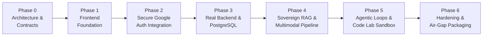

# KELVRIN: Phased Engineering Roadmap

---

## 1. Phasing Strategy Overview

The KELVRIN Sovereign Agentic AI Workbench is engineered through an incremental, rigorous development lifecycle. Each phase delivers a complete, verifiable subsystem with zero architectural shortcuts or fake mockups, building systematically from contracts to frontend foundation, authentication, backend persistence, local RAG, and agentic sandboxing.

---

## 2. Detailed Phase Specifications

### Phase 0: Architectural Foundation & Project Contracts (CURRENT)
- **Primary Goal**: Establish complete architectural blueprints, technical contracts, security models, database designs, API specifications, and directory structure.
- **Key Deliverables**:
  - `ARCHITECTURE.md`: High-level topology, responsibilities, and system lifecycles.
  - `PROJECT_CONTRACT.md`: Invariants, zero-leakage contracts, API envelopes, and environment contracts.
  - `SECURITY_MODEL.md`: RBAC matrix, token verification sequence, sandbox isolation, and audit schema.
  - `DEVELOPMENT_PHASES.md`: Detailed engineering roadmap and verification milestones.
  - `API_DESIGN.md`: Comprehensive OpenAPI 3.1 specification for all 17 modules and health probes.
  - `DATABASE_DESIGN.md`: Complete PostgreSQL relational schema, indexes, and pgvector integration.
  - `FOLDER_STRUCTURE.md`: Standardized directory tree for frontend, backend, docker, and scripts.
- **Verification Criteria**: Internally consistent specifications with zero conflicting types, routes, or roles.

---

### Phase 1: Frontend Foundation (React + TypeScript + Vite + Tailwind CSS)
- **Primary Goal**: Build the complete, responsive, enterprise-grade user interface inspired by the provided dashboard reference design.
- **Technology Stack**:
  - React 18, TypeScript (strict mode), Vite
  - Tailwind CSS (clean enterprise palette: navy navigation, light workspace, subtle green status badges, purple/blue AI accents)
  - React Router v6
  - Lucide React icons
  - Recharts for enterprise data visualizations
- **Application Shell**:
  - Reusable Topbar, Sidebar, Breadcrumbs, Page Title, User Profile Menu, Status Indicator, Toast notifications.
  - Core primitives: Button, Card, Badge, Modal, Drawer, DataTable, Input, Select, Tabs, EmptyState, LoadingSpinner.
- **All 17 Route Pages (Working Mock Data)**:
  1. `/login`: Sovereign login page with Google Sign-In button, security badges, and clear sovereignty statement.
  2. `/dashboard`: Key metrics (Active Agents, Documents, Queries Today, Storage Used), Query Overview chart, Top Agent Usage chart, System Status, Model Status, Sovereignty Card.
  3. `/ai-assistant`: Conversational interface, model selector, prompt presets, streaming message simulator.
  4. `/agents`: Autonomous agent cards, status indicators, execution trigger modal, trace viewer.
  5. `/documents`: Document table, upload modal, status badges (Ready, Processing, Error), size, date.
  6. `/documents/:id/chat`: Split-pane document viewer and conversational Q&A with citation highlights.
  7. `/knowledge-base`: Vector index statistics, collections, chunk inspector, re-index button.
  8. `/workflows`: Visual DAG pipeline viewer, workflow templates, execution trigger.
  9. `/analytics`: Token consumption charts, latency breakdowns, query volume by department.
  10. `/code-lab`: Sandboxed Python/Bash editor, execution panel, stdout/stderr display, resource counters.
  11. `/models`: Registered local models, quantization tags, VRAM usage indicators, routing rules.
  12. `/system-monitor`: GPU/VRAM telemetry, CPU/RAM charts, queue depth, disk usage.
  13. `/security`: Network egress monitor, air-gap status indicator, connector permission gates.
  14. `/audit-logs`: Immutable log table with search, filter by actor, action, timestamp, and payload drawer.
  15. `/users`: User management table, role assignment dropdowns, status toggles (Active/Suspended).
  16. `/settings`: Sovereign mode toggles, local model inference endpoints, storage paths.
  17. `/tools`: Tool and connector registry, approval toggles, parameters inspector.
- **Verification Criteria**: `npm run build` succeeds with zero TypeScript or Vite errors. All 17 routes render cleanly without dead links or console errors.

---

### Phase 2: Secure Google Authentication Integration
- **Primary Goal**: Integrate Firebase Authentication strictly as an external identity provider for Google Sign-In, coupled with backend cryptographic token verification and local user resolution.
- **Key Modules**:
  - `frontend/src/features/auth/`: Firebase client SDK wrapper, AuthProvider context, `useAuth` hook, ProtectedRoute guard.
  - `backend/app/core/auth.py`: Token verifier using Google's public JWKS certificates and `firebase-admin` fallback.
  - `backend/app/api/v1/auth.py`: `/google-login` endpoint accepting Google ID token, creating/updating local user, and minting KELVRIN session token.
  - Air-Gapped Fallback: Documented mock/local authentication provider switch (`KELVRIN_AUTH_MODE`).
- **Verification Criteria**:
  1. Unauthenticated users cannot access protected routes.
  2. Authenticated Google users receive valid sovereign session tokens.
  3. Disabled users are rejected with 403 Forbidden.
  4. Page refreshes preserve authenticated session state.
  5. Sign-out clears all local credentials.
  6. Zero usage of Firestore, Firebase Storage, or Firebase Functions.

---

### Phase 3: Real Backend Foundation & PostgreSQL Persistence
- **Primary Goal**: Implement the production Python FastAPI backend, PostgreSQL relational database with SQLAlchemy 2.0 and Alembic migrations, Docker Compose orchestration, and backend-enforced RBAC.
- **Key Modules**:
  - Database schema: 18 relational tables with proper indexes, foreign keys, and audit logging triggers.
  - API routers: Complete implementation of `/api/v1/*` routes with Pydantic v2 schemas and pagination.
  - Security middleware: RBAC permission dependency (`require_permission`) validating user roles against DB.
  - Health probes: `GET /api/v1/health` and `GET /api/v1/ready`.
  - Docker Compose: Multi-container setup for `frontend`, `backend`, and `postgres` with health checks.
- **Verification Criteria**:
  - Automated test suite (`pytest`) verifies DB connections, token authentication, RBAC authorization, and user CRUD.
  - Docker Compose boots all services cleanly into healthy states.

---

### Phase 4: Sovereign Document Ingestion & Local RAG Pipeline
- **Primary Goal**: Build the end-to-end local document processing and retrieval-augmented generation engine.
- **Key Features**:
  - Document ingestion for PDF, DOCX, XLSX, and scanned images.
  - Local OCR extraction for scanned documents.
  - Token-aware sliding window chunking with structural preservation.
  - `pgvector` dense vector indexing using local embedding models (e.g., `BAAI/bge-m3`).
  - Hybrid retrieval combining PostgreSQL full-text search (`tsvector`) and vector cosine similarity.
  - Grounded citation generation mapping every response sentence to document chunks and page numbers.

---

### Phase 5: Local Agentic Workflows & Sandboxed Code Lab
- **Primary Goal**: Implement autonomous agent reasoning loops, tool dispatching, and secure isolated code execution.
- **Key Features**:
  - ReAct orchestrator: Goal &rarr; Plan &rarr; Action &rarr; Observation &rarr; Validation &rarr; Deliverable.
  - Tool execution runner with approval gates (Human-in-the-loop).
  - Code Lab: Micro-container sandbox execution with disabled network access (`--network none`), strict CPU/memory limits, read-only root filesystems, and 60-second timeouts.
  - Real-time step streaming over Server-Sent Events (SSE).

---

### Phase 6: Production Hardening, System Telemetry & Air-Gap Packaging
- **Primary Goal**: Hardening the full stack for production deployment and disconnected air-gapped enclaves.
- **Key Features**:
  - Hardware telemetry collector: Real-time GPU VRAM, temperature, compute load, and inference queue depth.
  - Tamper-evident audit log export with cryptographic hash chaining.
  - Offline air-gap distribution bundle (pre-built container images, offline model weight caching script, and local OIDC provider setup).
  - End-to-end integration and security regression test suite.
