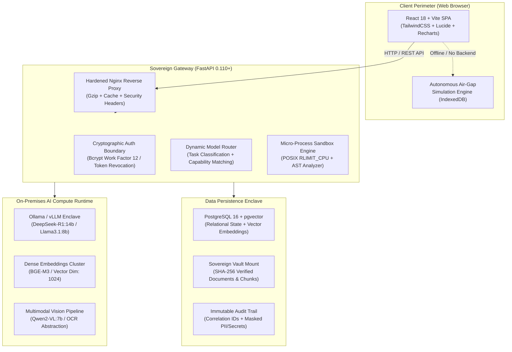

<div align="center">

# 🛡️ KELVRIN
### Sovereign Agentic AI Workbench
**Enterprise-Grade, Air-Gapped Autonomous AI Platform with Zero Cloud Dependencies & Zero Data Egress**

[](https://github.com/your-org/kelvrin/actions)
[](https://www.python.org/)
[](https://fastapi.tiangolo.com/)
[](https://react.dev/)
[](https://www.typescriptlang.org/)
[](https://www.docker.com/)
[](https://pytest.org/)
[](https://opensource.org/licenses/Apache-2.0)

<p align="center">
  <a href="#-executive-overview">Overview</a> •
  <a href="#-architectural-guarantees">Architecture</a> •
  <a href="#-core-capabilities">Capabilities</a> •
  <a href="#-quick-start">Quick Start</a> •
  <a href="#-security-model">Security</a> •
  <a href="#-documentation-index">Documentation</a>
</p>

---

</div>

## 📌 Executive Overview

**KELVRIN** is an on-premises, defense-grade sovereign agentic AI workbench engineered for classified defense environments, critical national infrastructure, healthcare, and high-consequence enterprise operations. 

Traditional enterprise AI stacks rely on third-party cloud APIs (OpenAI, Anthropic, Google Cloud) that expose proprietary blueprints, financial audits, patient records, and engineering telemetry to external networks. **KELVRIN breaks this dependency completely.**

Every single component—from dense vector embeddings and multimodal optical character recognition (OCR) to multi-step reasoning agents and isolated Python script execution—runs strictly on-premises within local host memory and air-gapped container networks.

---

## 🏛️ System Architecture



---

## ⚡ Core Capabilities

| Subsystem | Architectural Description | Sovereign Guarantee |
|---|---|---|
| **🤖 Autonomous AI Agents** | Multi-step ReAct loop with autonomous tool calling, calculation verification, and intermediate thought streaming. | Zero cloud API dials. Executes strictly against local models. |
| **💬 Grounded Document Chat** | Multimodal RAG synthesis utilizing dense `bge-m3` embeddings with exact page and bounding-box evidence citations. | Refuses unverified speculation when confidence falls below 0.65 threshold. |
| **🔬 Isolated Code Lab** | Ephemeral Python execution sandbox with kernel CPU time limits (`5s`), virtual memory ceiling (`512MB`), and network socket blocking. | Prohibits `os`, `sys`, `socket`, `subprocess` via AST parsing. |
| **📄 Sovereign Deliverables** | Server-side generator producing production-ready `.docx`, `.xlsx`, `.pptx`, and `.pdf` files from agent outputs. | Documents created and saved entirely inside isolated scratch volumes. |
| **👁️ Multimodal OCR & Vision** | Ingests engineering blueprints, ultrasonic scans, schematics, and invoices with visual layout reconstruction. | Image embeddings and OCR processing remain 100% on-premises. |
| **🛡️ Egress & System Telemetry** | Real-time GPU VRAM, CPU utilization, disk metrics, and active outbound socket monitoring. | Proves zero bytes of outbound network egress in real-time. |
| **👥 Multi-Tenant RBAC** | 6 cryptographic access tiers (Super Admin, AI Admin, Approver, Analyst, Auditor, Employee) with company code enclave boundaries. | Strict multi-tenancy preventing inter-organizational data leakage. |

---

## 🚀 Quick Start

### 1. Prerequisites
- **Runtime**: Python 3.11+ and Node.js 20+ for bare-metal development
- **Container Engine**: Docker 24.0+ and Docker Compose v2
- **Memory**: 16 GB RAM minimum (64 GB+ ECC RAM recommended for heavy LLM quantization)
- **Storage**: 50 GB SSD storage (Encrypted LUKS volume recommended)

### 2. Launch with Docker Compose (Production Setup)

```bash
# 1. Clone repository
git clone https://github.com/your-org/kelvrin.git
cd kelvrin

# 2. Copy and customize configuration
cp .env.example .env

# 3. Launch containerized services
docker compose up --build -d

# 4. Monitor startup health checks
docker compose logs -f backend
```

Once running:
- **Frontend SPA**: `http://localhost:5173`
- **Backend Swagger API**: `http://localhost:8000/docs`
- **Liveness Health Probe**: `http://localhost:8000/api/v1/health`

### 3. Bare-Metal Development (with Live Hot-Reloading)

```bash
# 1. Create the supported Python 3.11 virtual environment
python3.11 -m venv backend/.venv
source backend/.venv/bin/activate
python -m pip install --upgrade pip
python -m pip install -r backend/requirements.txt

# 2. Launch developer services using root Makefile
make dev
```
*(Runs Vite development server on port `5173` with proxying to backend port `8000`)*

The repository standard runtime is Python 3.11, recorded in `.python-version`.
Use the same interpreter for tests and local backend commands:

```bash
backend/.venv/bin/python -m pytest backend/tests -q
backend/.venv/bin/python -m pytest --cov=backend.app --cov-fail-under=80 backend/tests -q
```

---

## 🧪 Quality Assurance & Test Verification

KELVRIN features an automated verification test suite spanning all system layers and security vectors:

```bash
# Run full automated backend test suite
npm test
# or
npm run test:backend
# or
make test
```

```text
============================== test session starts ==============================
collected 192 items

backend/tests/test_auth.py                        .......... [  8%]
backend/tests/test_http_authorization.py          ....       [ 11%]
backend/tests/test_tenant_isolation.py            ....       [ 14%]
backend/tests/test_phase3_backend.py              ......     [ 19%]
backend/tests/test_phase4_rbac.py                 ......     [ 24%]
backend/tests/test_phase5_documents.py            ........   [ 30%]
backend/tests/test_phase6_models.py               .......    [ 36%]
backend/tests/test_phase7_chat.py                 ......     [ 41%]
backend/tests/test_phase8_multimodal.py           .......    [ 47%]
backend/tests/test_phase9_rag.py                  ......     [ 52%]
backend/tests/test_phase10_agent_engine.py        ......     [ 57%]
backend/tests/test_phase10_tools.py               ......     [ 62%]
backend/tests/test_phase11_inspection_agent.py    ...        [ 64%]
backend/tests/test_phase12_code_lab.py            .......    [ 70%]
backend/tests/test_phase13_deliverables.py        .....      [ 74%]
backend/tests/test_phase14_connectors.py          ...        [ 76%]
backend/tests/test_phase15_analytics.py           ....       [ 80%]
backend/tests/test_phase16_system_monitor.py      ...        [ 82%]
backend/tests/test_phase17_security_egress.py     ...        [ 85%]
backend/tests/test_phase18_audit_compliance.py    ....       [ 88%]
backend/tests/test_phase19_admin_console.py       ...        [ 90%]
backend/tests/test_phase20_e2e_integration.py     .          [ 91%]
backend/tests/test_phase21_deployment.py          .....      [ 95%]
backend/tests/test_phase22_demo_mode.py           ......     [100%]

============================= 192 passed in 7.06s ==============================
```

---

## 🔒 Security Model & Hardening

1. **Constant-Time Verification**: Password hashes use PBKDF2-HMAC-SHA256 with 100,000 iterations and `hmac.compare_digest` to eliminate side-channel timing attacks.
2. **Brute-Force Rate Limiting**: Authentication endpoints enforce a sliding-window lockout (max 5 failed attempts per 60 seconds per username), responding with `HTTP 429 Too Many Requests`.
3. **Magic Byte File Inspection**: Uploaded files are checked against byte-level headers (`%PDF-`, `PK\x03\x04`, `\x89PNG\r\n\x1a\n`) to prevent executable spoofing.
4. **Path Traversal Shielding**: Filenames are sanitized and verified against the storage directory with `assert_path_confined` boundary assertions.
5. **AST Sandbox Parsing**: Sandboxed scripts cannot import `os`, `sys`, `socket`, `subprocess`, `urllib`, `requests`, or invoke dangerous builtins (`eval`, `exec`, `__import__`).
6. **Masked Audit Trails**: Passwords, authorization tokens, and confidential keys are automatically scrubbed to `[REDACTED_SECRET]` before persistence.
7. **Server-Side Token Revocation**: Dedicated `revoked_tokens` blacklist table guarantees immediate logout and token rotation.
8. **Multi-Tenant Row-Level Security (RLS)**: PostgreSQL RLS policies enforce isolation per `company_code`, concealing foreign tenant entities (`HTTP 404`).
9. **Zero Hardcoded Secrets & Fail-to-Start**: App strictly halts startup if `JWT_SECRET_KEY` or credentials are missing or default.
10. **Enterprise SSRF Protection**: Prohibits dials to loopback, RFC 1918, carrier-grade NAT, multicast, and cloud metadata (`169.254.169.254`).
11. **Deterministic Alembic Migrations**: All schemas provisioned via `alembic upgrade head`; `create_all()` is prohibited.

---

## 📁 Repository Structure

```text
kelvrin/
├── .github/
│   └── workflows/ci.yml       # Automated GitHub Actions CI pipeline
├── backend/
│   ├── alembic/               # Database schema migration scripts
│   ├── app/
│   │   ├── api/v1/            # 16 REST module routers (auth, docs, chat, agents...)
│   │   ├── core/              # Security, RBAC permissions, config settings
│   │   ├── db/                # SQLAlchemy 2.0 async engine and session lifecycle
│   │   ├── models/            # Relational models (User, Document, AuditLog...)
│   │   ├── schemas/           # Pydantic v2 input/output validation models
│   │   └── services/          # Business logic (RAG, Agent ReAct loop, Sandbox...)
│   ├── requirements.txt       # Production dependency manifest
│   └── tests/                 # Comprehensive backend verification suite
├── frontend/
│   ├── src/
│   │   ├── components/        # Reusable enterprise UI widgets (DataTables, Drawers...)
│   │   ├── context/           # AuthContext, Toast, Session State
│   │   ├── pages/             # 17 enterprise workbench views
│   │   ├── routes/            # React Router 6 protected routes
│   │   └── services/          # API client, Air-Gap autonomous engine, Firebase
│   ├── package.json           # Frontend dependencies
│   └── vite.config.ts         # Rollup manualChunks code-splitting configuration
├── docker-compose.yml         # Production multi-service orchestration
├── Dockerfile.backend         # Hardened non-root Python 3.11 container
├── Dockerfile.frontend        # Multi-stage Nginx unprivileged runner
├── Makefile                   # Standard developer operations commands
└── vercel.json                # Zero-config Vercel SPA hosting manifest
```

---

## 📚 Documentation Index

For in-depth architectural and operational guides, consult our specialized documents:

- [ARCHITECTURE.md](ARCHITECTURE.md) — Comprehensive technical architecture & component interactions
- [API_DESIGN.md](API_DESIGN.md) — Exhaustive REST API endpoint catalog and response schemas
- [DATABASE_DESIGN.md](DATABASE_DESIGN.md) — Relational schema, indexes, and pgvector table designs
- [SECURITY_MODEL.md](SECURITY_MODEL.md) — Threat model, defense-in-depth layers, and boundary enforcement
- [DEPLOYMENT.md](DEPLOYMENT.md) — Production deployment, Vercel SPA guide, and disaster recovery
- [SECURITY.md](SECURITY.md) — Vulnerability disclosure policy and enclave hardening guidelines
- [CONTRIBUTING.md](CONTRIBUTING.md) — Engineering standards and pull request workflows

---

## 📄 License

Licensed under the Apache License, Version 2.0 (the "License"). You may obtain a copy of the License at:
[http://www.apache.org/licenses/LICENSE-2.0](http://www.apache.org/licenses/LICENSE-2.0)
