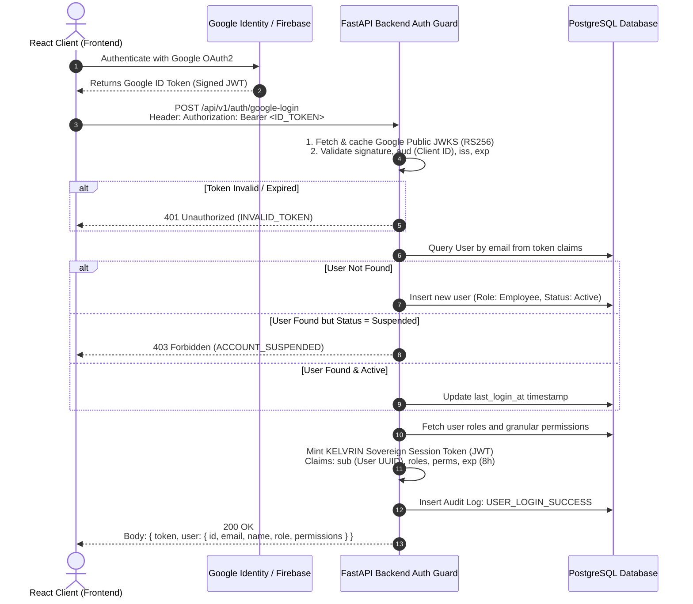

# KELVRIN: Zero-Trust Security Model & RBAC Architecture

---

## 1. Zero-Trust Security Foundations

KELVRIN implements a **Defense-in-Depth, Zero-Trust Architecture** designed for classified, regulated, and high-consequence enterprise environments.

### Core Security Tenets
1. **Never Trust the Client**: Frontend UI route guards, conditional rendering, and button disabling are strictly user experience enhancements. The FastAPI backend validates cryptographic identity, active user status, and fine-grained permissions on **every single endpoint call**.
2. **Explicit Verification of External Identity**: Google/Firebase tokens are treated as untrusted input until verified against official public JWKS certificates. External claims cannot grant internal application roles.
3. **Data Boundary Enforcement**: Confidential intellectual property (documents, embeddings, prompts, reasoning traces) must remain strictly within sovereign, access-controlled boundaries.
4. **Least Privilege by Default**: Roles and users receive the minimum set of permissions necessary to execute their duties. High-risk operations (e.g., executing code, registering external tools, modifying model routing) require elevated administrative or manager roles.
5. **Separation of Duties**: AI model administrators cannot arbitrarily view confidential executive documents; document owners cannot modify sandbox container policies.
6. **Immutable Accountability**: All state transitions, authorization failures, and data accesses generate structured audit records.

---

## 2. Threat Model & Mitigations (STRIDE Matrix)

| STRIDE Threat | Attack Vector | KELVRIN Architectural Mitigation |
|---|---|---|
| **Spoofing** | Forged JWTs or hijacked Google ID tokens | Backend verifies Google RS256 signatures via public JWKS; issues short-lived, encrypted internal sovereign tokens with cryptographic expiration. |
| **Tampering** | Modifying document chunks or agent step parameters | SHA-256 content hashing on document ingestion; HMAC-signed step traces; database-level foreign key and constraint validation. |
| **Repudiation** | User denies uploading sensitive file or running malicious prompt | Append-only audit log recording actor UUID, IP address, user agent, action timestamp, resource ID, and SHA-256 payload digest. |
| **Information Disclosure** | Data leakage to external LLM APIs or unauthorized internal roles | 100% on-premises model inference; network egress blocking (`--network none` in sandbox); row-level security and document-level permission ACLs in PostgreSQL. |
| **Denial of Service** | Exhausting local GPU VRAM or running infinite Python loops in Code Lab | Kernel-enforced cgroups (CPU/RAM limits), wall-clock timeouts (60s), model queue depth limits, and rate limiting via token bucket algorithms. |
| **Elevation of Privilege** | Standard employee modifying role or executing unapproved tools | Strict backend dependency checks (`require_permission`); role modifications restricted to `Super Admin`; tool execution requires explicit permission scopes. |

---

## 3. Role-Based Access Control (RBAC) Matrix

### 3.1 User Roles
1. **Super Admin**: Sovereign platform owner. Manages users, system settings, global security policies, audit logs, and infrastructure nodes.
2. **AI Admin**: AI infrastructure specialist. Manages model registries, VRAM allocations, model routing rules, and tool registrations.
3. **Approver / Manager**: Operational oversight. Approves agent actions (human-in-the-loop), reviews workflows, and manages team document access.
4. **Analyst**: Power user. Runs autonomous agent workflows, executes sandboxed code in Code Lab, queries documents, and curates knowledge bases.
5. **Employee**: Standard user. Interacts with conversational AI Assistant, executes pre-approved workflows, and performs search on accessible documents.
6. **Viewer / Auditor**: Compliance reviewer. Read-only access to audit logs, compliance reports, system health, and verification trails.

### 3.2 Granular Permission Matrix Across 17 Core Modules

| # | Core Module | Super Admin | AI Admin | Approver / Manager | Analyst | Employee | Viewer / Auditor |
|---|---|:---:|:---:|:---:|:---:|:---:|:---:|
| 1 | **Authentication** | Admin | Read | Read | Read | Read | Read |
| 2 | **Dashboard** | Full (All) | Full (AI/Sys) | Full (Team) | Full (Self) | Read (Self) | Read (Audit) |
| 3 | **AI Assistant** | Full | Full | Full | Full | Full | None |
| 4 | **Agents** | Full | Full | Approve / Run | Create / Run | Run (Pre-Apprv) | Read Traces |
| 5 | **Documents** | Full (Manage) | Read | Manage / Share | Upload / Read | Read (Assigned) | Read (Meta) |
| 6 | **Document Chat / Q&A** | Full | Read | Full | Full | Full (Assigned) | None |
| 7 | **Knowledge Base** | Full | Full | Curate | Curate | Search | Read (Meta) |
| 8 | **Workflows** | Full | Manage | Approve / Run | Create / Run | Run (Pre-Apprv) | Read Logs |
| 9 | **Analytics** | Full | Full | Team View | Self View | Self View | Full (Reports) |
| 10 | **System Monitoring** | Full | Full | Read | Read | None | Read |
| 11 | **Model Center** | Full | Manage / Route | Read | Read | None | None |
| 12 | **Code Lab** | Full | Read | Approve Exec | Execute Sandbox | None | Read Runs |
| 13 | **Audit Logs** | Full (Search) | None | Team Logs | None | None | Full (Auditing) |
| 14 | **Security / Network** | Full | Read | None | None | None | Read (Posture) |
| 15 | **User Management** | Full | None | Team Users | None | None | Read (Users) |
| 16 | **Settings** | Full | AI Settings | None | None | None | None |
| 17 | **Connector / Tools** | Full | Manage | Approve Gate | Use Approved | Use Approved | None |

*Legend: `Full` = Read, Write, Delete, Administer; `Manage` = Read, Write, Configure; `Read` = Read-only access; `None` = Access denied.*

---

## 4. Authentication Architecture & Token Exchange

### 4.1 Token Verification Flow


### 4.2 Local / Air-Gapped Authentication Fallback
When operating in disconnected or classified environments where internet connectivity to Google servers is prohibited:
1. `KELVRIN_AUTH_MODE` is set to `airgap_local`.
2. The frontend suppresses Google Sign-In and renders standard enterprise username/password or local CAC/PIV smart-card authentication.
3. The backend validates credentials against a locally salted bcrypt/Argon2 password hash in PostgreSQL or local LDAP/Kerberos.
4. Sovereign Session Tokens are minted identically, preserving consistent downstream authorization logic.

---

## 5. Code Lab & Sandbox Isolation Security

To fulfill Principle 11 ("Code execution must be isolated and must not have unrestricted host or network access"), KELVRIN deploys a dedicated execution container architecture.

```
+-------------------------------------------------------------------------+
| HOST SERVER (FastAPI Backend)                                           |
|                                                                         |
|   Sandbox Manager (Python)                                              |
|       |                                                                 |
|       | 1. Write Code to Ephemeral In-Memory Volume                     |
|       | 2. Spawn Container via Docker Socket / gVisor Runtime           |
|       v                                                                 |
|   +-----------------------------------------------------------------+   |
|   | ISOLATED SANDBOX CONTAINER                                      |   |
|   | Runtime: gVisor (runsc) or Docker Engine                         |   |
|   | User: non-root (uid 10001)                                      |   |
|   | Network: --network none (ZERO EGRESS / NO SOCKETS)             |   |
|   | Filesystem: --read-only (Host FS strictly hidden)              |   |
|   | Memory: --memory 1024m --memory-swap 1024m                      |   |
|   | CPU: --cpus 1.0                                                 |   |
|   | PIDs Limit: --pids-limit 64 (Fork bomb mitigation)              |   |
|   | Caps: --cap-drop ALL (Zero Linux capabilities)                  |   |
|   | Mounts: tmpfs /tmp (size=64m, noexec, nosuid)                   |   |
|   | Timeout: 60 seconds (Kernel SIGKILL on overrun)                |   |
|   +-----------------------------------------------------------------+   |
|       |                                                                 |
|       | 3. Capture stdout, stderr, exit_code (capped at 500KB)          |
|       v                                                                 |
|   Sanitized Output Returned to Agent / User                             |
+-------------------------------------------------------------------------+
```

---

## 6. External Connector & Tool Security

1. **Default Deny Policy**: In accordance with Principle 19, all external network connectors (e.g., external search APIs, webhook senders, third-party database connectors) are **disabled by default**.
2. **Administrative Enablement Gate**: Enabling an external tool requires `AI Admin` or `Super Admin` privileges and triggers an immutable audit log entry.
3. **Execution Guardrails**:
   - Web retrieval tools enforce strict URL domain allowlisting.
   - SQL query tools operate exclusively against read-only database credentials with query timeouts and forbidden keywords (`DROP`, `ALTER`, `TRUNCATE`, `GRANT`).
   - Human-in-the-Loop (HITL) approval is mandatory for any tool flagged as state-mutating.

---

## 7. Tamper-Evident Audit Logging Specification

### 7.1 Audit Event Record Schema
Every security-relevant event produces a record conforming to the following schema:
```json
{
  "event_id": "8f3b2c1a-5d4e-4f6a-9b8c-1e2d3f4a5b6c",
  "timestamp": "2026-09-13T19:13:00.124Z",
  "actor": {
    "user_id": "u_987654321",
    "email": "analyst@enterprise.internal",
    "role": "Analyst",
    "ip_address": "10.14.22.8",
    "user_agent": "Mozilla/5.0 (Macintosh; Intel Mac OS X 10_15_7)..."
  },
  "action": "DOCUMENT_DOWNLOAD",
  "resource": {
    "type": "document",
    "id": "doc_44556677",
    "name": "Q3_Strategic_Review_Confidential.pdf",
    "sha256": "e3b0c44298fc1c149afbf4c8996fb92427ae41e4649b934ca495991b7852b855"
  },
  "status": "SUCCESS",
  "details": {
    "byte_size": 2458912,
    "classification": "RESTRICTED"
  },
  "chain_hash": "a1b2c3d4e5f6..."
}
```

### 7.2 Mandatory Audited Action Catalog
- `AUTH_LOGIN_SUCCESS`, `AUTH_LOGIN_FAILURE`, `AUTH_LOGOUT`, `AUTH_TOKEN_REFRESH`
- `USER_CREATE`, `USER_SUSPEND`, `USER_ROLE_CHANGE`, `USER_DELETE`
- `DOC_UPLOAD`, `DOC_DELETE`, `DOC_PERMISSION_CHANGE`, `DOC_QUERY_EXECUTE`
- `AGENT_RUN_INITIATED`, `AGENT_TOOL_CALLED`, `AGENT_APPROVAL_GRANTED`, `AGENT_RUN_COMPLETED`
- `CODE_EXECUTION_REQUESTED`, `CODE_EXECUTION_TERMINATED`, `CODE_SANDBOX_TIMEOUT`
- `MODEL_REGISTERED`, `MODEL_ROUTING_MODIFIED`, `TOOL_CONNECTOR_ENABLED`

---

## 8. Multi-Tenant Row-Level Security (RLS) & Concealment

### 8.1 Database-Level Isolation
All tenant-scoped tables (`users`, `documents`, `deliverables`, `conversations`, `agent_runs`) are guarded by PostgreSQL Row-Level Security:
```sql
ALTER TABLE documents ENABLE ROW LEVEL SECURITY;
CREATE POLICY tenant_isolation_policy ON documents
FOR ALL
USING (company_code IS NULL OR company_code = current_setting('app.current_company_code', true));
```
When an authenticated request is received, the ASGI middleware binds the caller's `company_code` to the transaction session (`SET LOCAL app.current_company_code = :company_code`).

### 8.2 Concealment-First Authorization
To prevent side-channel resource enumeration, any request targeting an entity belonging to a different tenant triggers `HTTP 404 Not Found` rather than `403 Forbidden` via `authorize_tenant_access`.

---

## 9. Token Revocation & Cryptographic Session Management

### 9.1 Revocation Table
Session tokens are tracked server-side in the `revoked_tokens` table:
- `token_hash`: SHA-256 digest of the raw JWT.
- `jti`: Unique JWT ID claim.
- `revoked_at`: Timestamp when session was terminated.
- `expires_at`: Natural expiration of the token.

### 9.2 Request-Level Revocation Checks
The `get_current_user` dependency evaluates the revocation table on every request. If a match is found, the call is terminated with `HTTP 401 Unauthorized` (`"Token has been revoked"`).

### 9.3 Refresh Rotation
Token refresh (`POST /api/v1/auth/refresh`) invalidates the presenting token and issues a fresh, cryptographically distinct access token.

---

## 10. Connector SSRF Defense Matrix

External connectors implement strict network safety boundaries:
1. **Scheme Whitelist**: Prohibits non-HTTP protocols (`file://`, `gopher://`, `ftp://`).
2. **Private Network Blacklist**: Blocks dials to:
   - `127.0.0.0/8`, `::1` (Loopback)
   - `10.0.0.0/8`, `172.16.0.0/12`, `192.168.0.0/16` (Private RFC 1918)
   - `169.254.0.0/16` (Link-Local & Cloud Metadata `http://169.254.169.254`)
   - `100.64.0.0/10` (Carrier-Grade NAT)
   - `224.0.0.0/4` (Multicast)
3. **DNS Rebinding Shield**: Connector resolves target domains and validates all candidate IP addresses against the blocklist prior to socket connection.

---

## 11. Document Ingestion Security & Vault Confinement

1. **Magic Byte Signature Inspection**: Files must match their declared type at the byte header level (`%PDF-` for PDF, `PK\x03\x04` for Office OpenXML, `\x89PNG` for PNG).
2. **Extension Whitelisting**: Strict allowlist (`.pdf`, `.docx`, `.xlsx`, `.txt`, `.png`, `.jpg`, `.jpeg`).
3. **Filename Sanitization**: Path traversal sequences (`../`, `..\\`) and dangerous characters are scrubbed via `sanitize_filename`.
4. **Path Confinement**: `assert_path_confined` verifies that the resolved realpath remains strictly within the designated on-premises storage volume.
